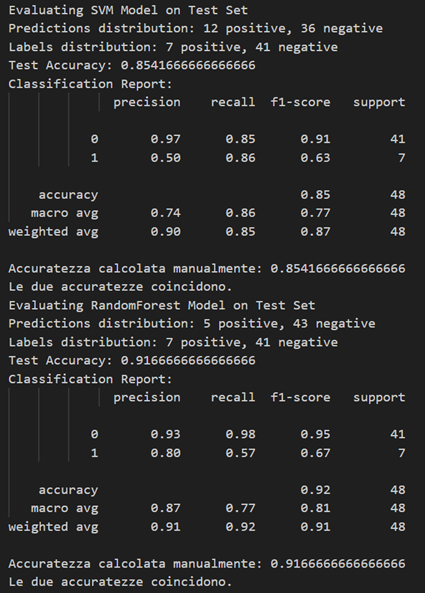

# Non-Destructive Internal Browning Detection in Apples

This research project, developed in collaboration with the **Free University of Bolzano (unibz)**, focuses on the development of a non-destructive classification system for detecting internal browning in apples. By leveraging impedance spectroscopy data (magnitude and phase angle), the pipeline provides an automated quality control tool to identify physiological degradations without damaging the fruit.

## Table of Contents
* [Project Structure](#project-structure)
* [Dataset Overview](#dataset-overview)
* [System Architecture](#️system-architecture)
* [Usage](#usage)
* [Performance Tracking](#performance-tracking)
* [Considerations and Future Developments](#considerations-and-future-developments)


## Project Structure
Here is represented the project tree expanding only the relevant files:

```bash
📦Project
 ┣ 📂images
 ┣ 📜dataset.py
 ┣ 📜Full Data Analysis- file, new revised_Sundus 1.xslx
 ┣ 📜impedenza_classification.ipynb
 ┣ 📜model.py
 ┣ 📜README.md
 ┗ 📜train_utils.py
```

## Dataset Overview
The dataset is sourced from complex multi-frequency impedance measurements stored in Excel workbooks.

* **Input Features**:
    * **Magnitude (ohm)**: Extracted across multiple frequency-dependent columns.
    * **Phase Angle (degree)**: Extracted across corresponding frequency-dependent columns.
* **Target Variable**: `Internal Browning` (Binary classification: `0` for No Browning, `1` for Browning detected).
* **Preprocessing**: The pipeline handles missing values (NaN), filters out irrelevant data points (e.g., 'FELIX' markers), and applies a `StandardScaler` within the model pipelines to ensure feature uniformity and model stability.

## System Architecture
The project is structured into modular Python scripts to ensure scalability and professional-grade reproducibility:

### 1. Data Management (`dataset.py`)
Implementation of the `AppleBrowningDataset` class (inheriting from `torch.utils.data.Dataset`):
* **Dynamic Column Selection**: Automated extraction of magnitude and phase features.
* **Label Encoding**: Binary mapping for browning symptoms.
* **PyTorch Integration**: Fully compatible with `DataLoader` for batch processing.

### 2. Model Optimization (`model.py`)
Two primary classifiers are implemented and optimized via `GridSearchCV` with **5-fold cross-validation**:

* **Support Vector Machine (SVM)**:
    * **Kernels**: Systematic search across Linear, Poly, and RBF kernels.
    * **Imbalance Handling**: Integrated support for `class_weight='balanced'`.
* **Random Forest Classifier**:
    * **Ensemble Tuning**: Optimization of `n_estimators` (up to 700) and `max_depth`.
    * **Robustness**: Grid search for optimal `min_samples_split` and `bootstrap` settings.

### 3. Training & Evaluation (`train_utils.py` & Notebook)
* **Workflow**: Utilizes a 70/30 train-test split strategy.
* **Pipelines**: Uses Scikit-Learn `Pipeline` objects to prevent data leakage during scaling.
* **Metrics**: Evaluation via Accuracy, Precision, Recall, and F1-Score classification reports.

## Usage

### Prerequisites
```bash
pip install torch pandas scikit-learn openpyxl numpy
```
### Running the Analysis
The main entry point is the Jupyter Notebook `impedenza_classification.ipynb`, which orchestrates the full pipeline:
* **Load the dataset** from the specified Excel sheet using the custom `AppleBrowningDataset` class.
* **Initialize** the SVM and Random Forest models.
* **Perform Grid Search** via `GridSearchCV` to find the best estimator for each model, optimizing hyperparameters through 5-fold cross-validation.
* **Generate performance metrics** on the unseen test set, including accuracy and detailed classification reports.

## Performance Tracking
The models are evaluated not only on raw accuracy but also on their ability to handle class distribution, ensuring the browning detection is sensitive enough for practical quality control applications.

</img>

## Considerations and Future Developments

### Project Assessment
* **Classification Effectiveness**: The developed pipeline is highly effective in addressing the specific classification problem of apple browning.
* **System Robustness**: The architecture demonstrates significant robustness in handling the experimental dataset.
* **Estimator Optimization**: The system is capable of autonomously identifying the best estimator through structured hyperparameter tuning.

### Possible Improvements
* **Parameters Scaling**: Refining the scaling techniques for model parameters to further stabilize training.
* **Data Distribution**: Implementing advanced strategies to better handle class imbalance within the dataset.
* **Model Scaling**: Developing more efficient scaling methods to improve overall system performance.

### Future Developments
* **Advanced Architectures**: Experimenting with more complex models, such as Neural Networks, to capture deeper patterns in impedance data.
* **Feature Reduction**: Applying dimensionality reduction techniques (e.g., PCA) to optimize the input feature set and improve computational efficiency.
